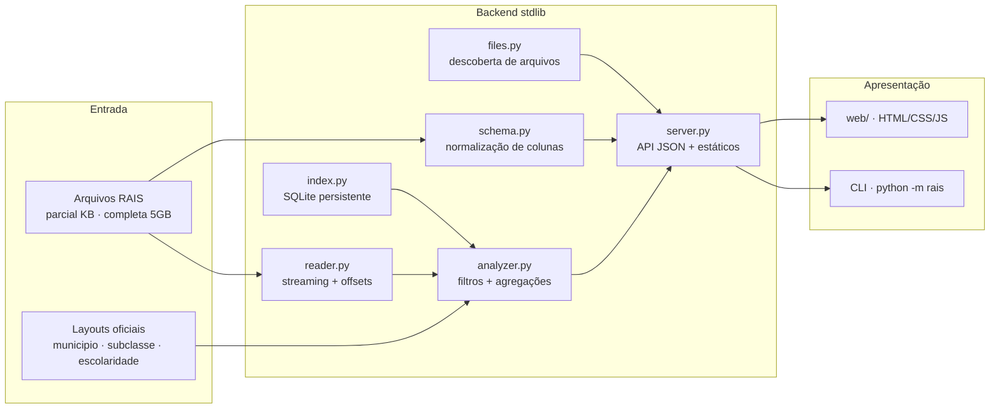

# RAIS · Filtro de Dados — Especificação Técnica

Documento de especificação da solução implementada, mapeando os requisitos de
[`docs/realtoriotecnico.txt`](./realtoriotecnico.txt) para decisões de
arquitetura e código.

---

## 1. Requisitos e rastreabilidade

| # | Requisito (fonte) | Implementação |
|---|---|---|
| R1 | Processamento **streaming** — não carregar arquivos de 5 GB+ em RAM | `src/rais/reader.py` — iteração linha a linha via `csv` (buffer interno); memória constante |
| R2 | Seleção **dinâmica do arquivo-base** (parcial p/ dev/CI, completa p/ prod) | `src/rais/files.py` + dropdown na interface (`web/app.js`) |
| R3 | **Indexação** de campos de alta cardinalidade (município, subclasse) | `src/rais/index.py` — índice persistente SQLite; consulta via `seek` |
| R4 | Variáveis de código tratadas como **STRING** (zeros à esquerda) | `schema.py` (normalização), `analyzer.py` (`_norm_code` nunca converte para int) |
| R5 | Tratar `-1`, `{ñ class}`, `{ñclass}` como **"Ignorado"** | `domains.py::is_ignored`; categoria "Informação Não Disponível/Ignorada" |
| R6 | Filtro geográfico `MUNICIPIO` | `analyzer.py::_matches` |
| R7 | Filtro setorial `SB CLAS 20` (subclasse CNAE 2.0) | `analyzer.py::_matches` |
| R8 | Contagem de **estabelecimentos únicos** (coluna de identificação, filtrado por TIPO ESTBL) | `analyzer.py::_aggregate_row` (conjunto de identificadores, ignora TIPO ESTBL `-1`) |
| R9 | **Vínculos** (somatório de registros) | `analyzer.py` — `vinculos` |
| R10 | **Distribuição de escolaridade** (frequência + %) | `analyzer.py` — contadores por nível 1..11 |
| R11 | Exceções segregadas da base de cálculo | `analyzer.py` — bucket `__ignorado__` + `ignorados_escolaridade` |

---

## 2. Arquitetura



**Fluxo da consulta**

1. O frontend/CLI informa `file`, `municipio`, `subclasse` e `use_index`.
2. O backend detecta o separador real (`,` — o layout cita `;` mas os dados usam `,`),
   a codificação (latin-1 nos dados; UTF-8 nos layouts) e mapeia o cabeçalho
   físico para as variáveis lógicas (tolerante a acentos/caixa).
3. A análise escolhe o modo:
   - **varredura integral**: itera todas as linhas em streaming;
   - **índice**: consulta o SQLite e lê apenas as linhas candidatas via `seek`.
4. Cada linha que casa os filtros é agregada: escolaridade e estabelecimentos.
5. O resultado é serializado em JSON (identificador a identificador).

---

## 3. Modelo de dados e mapeamento de variáveis

As colunas físicas dos arquivos fornecidos (62 colunas, separador `,`,
encoding latin-1) são mapeadas por **alias normalizado** em
`src/rais/config.py::LOGICAL_FIELDS`:

| Variável lógica | Alias aceitos (exemplos) | Uso |
|---|---|---|
| `municipio` | `Município - Código`, `MUNICIPIO` | filtro geográfico |
| `subclasse_cnae20` | `CNAE 2.0 Subclasse - Codigo`, `SB CLAS 20` | filtro setorial |
| `escolaridade` | `Escolaridade Após 2005 - Código`, `GR INSTRUCAO` | distribuição |
| `tipo_estabelecimento` | `Tipo Estabelecimento - Código`, `TIPO ESTBL` | filtro p/ contagem de empresas |
| `tipo_estabelecimento_nome` | `Tipo Estabelecimento - Nome` | contexto |
| `identificador_estabelecimento` | `Identificad`, `IDENTIFICAD`, `CNPJ/CEI` | unicidade de empresas |

A normalização (`schema.normalize_token`) remove acentos, caixa e separadores
("CNAE 2.0 Subclasse - Codigo" ≡ "cnae20subclasse codigo"), preservando a
comparação determinística. Códigos nunca são convertidos para inteiro.

### Domínios

- **Escolaridade** (`layout/RAIS_vinculos_layout_escolaridadeOUinstrucao.csv`):
  1..11 (Analfabeto..Doutorado) + `-1` (Ignorado).
- **Subclasses CNAE 2.0** (`subclasse2-0.csv`): `2342702` = "Fabricação de
  Artefatos de Cerâmica e Barro Cozido para Uso na Construção, Exceto Azulejos
  e Pisos".
- **Municípios** (`municipio.csv`): `330100` = "Rj-Campos dos Goytacazes".

---

## 4. Algoritmo do caso de uso (item 5 do dicionário técnico)

```
1. Filtragem
   predicado_geo  : municipio == "330100"
   predicado_set  : subclasse_cnae20 == "2342702"
2. Unicidade de empresas
   para linha casada:
     se coluna de identificação presente E tipo_estabelecimento não ignorado:
       adicionar identificador ao conjunto; incrementar vínculos da empresa
3. Métricas
   vinculos             = total de linhas casadas
   empresas             = |conjunto de identificadores|
   funcionarios/empresa = contagem por identificador
   escolaridade         = frequência + % por nível (1..11)
4. Exceções
   GR INSTRUCAO == -1 (ou fora de 1..11) -> categoria
   "Informação Não Disponível/Ignorada" (não corrompe a base de cálculo)
```

### Resultado (amostra de validação `dados/amostra_com_identificador.csv`)

| Métrica | Valor |
|---|---|
| Estabelecimentos | 3 |
| Vínculos | 19 |
| Vínculos considerados p/ empresas (TIPO ESTBL válido) | 18 |
| Escolaridade — ignorados (`-1`) | 2 (10,5 %) |

---

## 5. Decisões de projeto (ADR resumido)

### ADR-1 — Leitura streaming por linha
`csv.reader` consome o arquivo por buffer; cada linha é descartada após o
processamento. Para a base de 5 GB a memória permanece constante
(~poucos MB), atendendo R1. A varredura é O(n); com índice (ADR-2) as
consultas repetidas lêem apenas as linhas candidatas.

### ADR-2 — Índice persistente em SQLite (stdlib)
Tabela `rais_index(file, municipio, subclasse, row_no, offset)` com índice em
`(file, municipio, subclasse)`. Construção em uma varredura única (5 000
linhas/lote). Consulta: `SELECT offset ...` → `seek` + parse das linhas.

### ADR-3 — Identificador de estabelecimento configurável
A contagem de empresas exige a coluna de identificação (R8). Os arquivos
fornecidos **não** a possuem (verificado: 62 colunas nos dois arquivos). O
sistema:
- detecta a presença/ausência da coluna (`schema.missing`);
- quando presente: contagem exata + vínculos por empresa;
- quando ausente: reporta "indisponível" com aviso claro (não inventa número),
  mantendo corretas as demais métricas.
A amostra gerada por `scripts/make_sample.py` inclui a coluna `Identificad`,
permitindo validar ponta a ponta a contagem.

### ADR-4 — Sem dependências externas
Backend, frontend e testes usam somente a stdlib (csv, sqlite3,
http.server, unittest, json). Isso garante portabilidade e execução
imediata (`make test`, `make serve`) sem `pip install`.

### ADR-5 — Codificações distintas por origem
Dados RAIS: latin-1/CP1252. Layouts: UTF-8. `config.py` define codificações
padrão; o leitor respeita a do arquivo.

---

## 6. API do servidor

| Método | Rota | Descrição |
|---|---|---|
| GET | `/api/health` | status + versão |
| GET | `/api/files` | lista de arquivos (nome, tamanho, parcial/completa) |
| GET | `/api/layouts?tipo=&busca=&limit=` | taxonomias (escolaridade, subclasse, municipio) |
| GET | `/api/schema?file=` | colunas + campos lógicos presentes/ausentes |
| GET | `/api/index?file=` | status do índice |
| POST | `/api/index` `{file}` | constrói o índice (streaming) |
| POST | `/api/analyze` `{file, municipio, subclasse, use_index}` | executa a análise |

Todas as respostas em JSON UTF-8, CORS habilitado, `Cache-Control: no-store`.

---

## 7. Testes

`tests/` (43 casos, `unittest`):

- `test_schema.py` — normalização, separador, mapeamento lógico;
- `test_domains.py` — taxonomias e valores "Ignorado";
- `test_reader.py` — streaming, offsets, consistência seek;
- `test_analyzer.py` — caso de referência na amostra, arquivo parcial,
  sem-resultados, filtro parcial;
- `test_index.py` — construção, status, lookup, equivalência índice×varredura;
- `test_server.py` — API HTTP ponta a ponta (health, files, layouts, schema,
  analyze, página inicial).

Execução: `make test` (ou `PYTHONPATH=src python3 -m unittest discover -s tests`).
